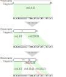

# Hi-C reassembler

Toolkit for the reassembly of structural variation (SV) in genomes using Hi-C contacts. The goal of this project is to automatically fix large inconsistencies between the reference genome and sample of interest, for example in the case of cancer cell lines or misassembled genomes.

This project is separated into 3 submodules:
* scramble: Simulating structural variants and constructing the associated Hi-C map, this is mainly used to generate training data.
* detect: Find the location of candidate breakpoints using Hi-C contact and refine the location using read alignments.
* reassemble: Edit the genome based on detected breakpoints to recover the sequence that matches Hi-C contacts.

## Installation

### Requirements

* Python 3.6 or later is required.
* The software [hicstuff](https://github.com/koszullab/hicstuff) is requiered for contact map generation. 
* The following librairies are required but will be automatically installed with the pip installation:
`joblib`,
`hicstuff`,
`keras`,
`matplotlib`,
`networkx`,
`numpy `,
`pandas`,
`pysam`,
`scikit-learn`,
`tensorflow`,
`tqdm`.
* The following software should be installed separately if you used the pip installation:
  * [bowtie2](http://bowtie-bio.sourceforge.net/bowtie2/index.shtml)
  * [samtools](http://www.htslib.org/)
  * [pairix](https://github.com/4dn-dcic/pairix)

To install Hi-C reassembler, run the following command line in the directory:

```bash
pip install -e .
```

The scripts use an `output` and a `tmpdir` directory. If you need to clean these directory, you can run

```
make clean
```

## Data structures used

Throughout the different submodules, the genome is represented as a collection of chromosomes. Each chromosome contains Fragments, which point to a reference sequence. Introducing SVs



## Dataset creation and training

Hi-C Reassembler detects potential breakpoints directly on the contact map, in order to avoid reading throught the entire alignement files.  
The matrix detection uses a Convolutional Neural Network that needs to be trained.

Two pretrained models are provided with the code: one for the detection on yeast contact maps and one for the detection on human contact maps.  
These models can be found in `data/pre-trained_models/`.

If the pretrained models are not good enough, this code also provides scripts allowing the user to generate its own dataset using a reference genome and Hi-C reads.
The dataset can be generated using the command line :

```dataset generation
python create_dataset/matrixdetector/create_dataset_matrix.py -1 reads_for -2 reads_rev -r repeat -c chrom -N sv_per_matrix genome outdir
```
* `genome` is the reference genome on which structural variations will be applied in order to create the dataset.
* `reads_for` and `reads_rev` are the Hi-C reads as fastq files that will be aligned on the scrambled genome.
* `outdir` is the output directory where the dataset will be saved.
* Several options can be set by the user. Some help concerning these options can be obtained with the command

```
python create_dataset/matrixdetector/create_dataset_matrix.py --help
```
```
Usage: create_dataset_matrix.py [OPTIONS] FASTA OUTDIR

  Creates scrambled matrix aligning reference reads on a scrambled genome. By
  selecting "both" as mat_type, a whole dataset is created and save as npy
  files for the specified contig. By selecting "scrambled", several scrambled
  matrix can be created with several arguments, without saving any dataset.

Options:
  -1, --reads1 PATH            Forward Hi-C reads  [required]
  -2, --reads2 PATH            Reverse Hi-C reads  [required]
  -b, --binsize INTEGER        Size of the bins for the matrices to generate,
                               in base pairs  [default: 1000]
  -t, --tmpdir PATH            Temporary directory to use for the runs
  -n, --name TEXT              Name of the scrambled matrices  [default:
                               scrambled]
  -r, --repeat INTEGER         Number of matrices to generate  [default: 50]
  -c, --chrom TEXT             Name of the chromosome to scramble  [required]
  -sv, --sv_type TEXT          Type of SVs you want to generate (TRA, INV,
                               DEL). Random between TRA and INV by default.
  -res, --reset                Cleans the output directory before running the
                               scrambling.
  -m, --mat_type TEXT          Select if you want to generate "scrambled"
                               images, "normal" images, or "both". "both" by
                               default will generate the whole dataset.
                               "scrambled" will only run some scrambling
                               without saving the dataset (usefull if you want
                               to generate some matrices without regenerating
                               a whole dataset).  [default: both]
  -a, --aligner TEXT           [default: bowtie2]
  -N, --sv_per_matrix INTEGER  Number of SV to generate per scrambled matrix.
                               [default: 5]
  -w, --wsize INTEGER          Size of the window to use for image generation.
                               [default: 128]
  --genome_only                Select if you want to generate only the
                               scrambled genomes without the matrices.
                               (without running hicstuff pipeline)
  --help                       Show this message and exit.

```


At each step, the genome is scrambled and a pipeline of hicstuff is run. The result of the pipelines are saved in the directory `outdir/scrambling/`.  
Once the dataset is finished, it is saved in the directory `outdir/dataset/`.

Once the files "outdir/dataset/imgs.npy" and "outdir/dataset/labels.npy" are moved to `data/training/matrixdetector/`, the training can be launched using the command 

```train
make train
```


## Detection & reassembly

After the training has been done, the program can detect SVs on Hi-C maps and reassemble the matrix.  
The steps of the pipeline used buy Hi-C reassembler are:
1. Detection of the breakpoints on the contact map, given as a `cooler` file. The breakpoints are detected thanks to a Convolutional Neural Nework: a sliding extracts 128x128 images centered on the main diagonal of the matrix and the CNN classifies these images between "breakpoint" and "no breakpoint".
2. Detection of the breakpoints in the alignment files given as `bam` files. Hi-C Reassembler detects the clipped and cut reads aligning on the reference genome. It detects spikes of the clipped reads divided by the total coverage while penalizing the spikes corresponding to restriction sites to avoid false positives.
3. Assembly of the breakpoints into SVs using the `pair` file. A score between each breakpoints is established based on the number of pair reads aligning next to them. The scores are used to assemble the structural variations, starting with the variation with the highest score.
4. Reassembly of the genome. HiC Reassemble uses a brute-force method and explores all the possible reassembly orders. The order with the best regression (p-value) is selected.
5. (Optional) New pipeline of hicstuff in order to generate the reassembled contact map.

This pipeline can be run with the following command line. 

```pipeline
python ./scripts/pipeline.py chrom_name cooler_file for_bam rev_bam pair_file ref_seq
```  
The detail of the options available can be showned using the `--help` argument.

It is also possible to just detect the breakpoints, without reassembly:

```sh
python ./scripts/detect.py chrom_name cooler_file for_bam rev_bam ref_seq
```

You can also simply reassemble the genome if you already know the positions of the breakpoints:

```sh
python ./scripts/reassemble.py chrom_name cooler_file pairfile ref_seq breakpoints
```

where *breakpoints* is a text file listing the known breakpoints of the mutated genome.


## Output

The outputs of the pipeline are stored in `data/output/`.

* "detected_breakpoints.txt", a list of the breakpoints detected after the detection on the matrix and the alignment files.
* "assembled_sv.txt", a list of the structural variations assembled by the program, based on the detected breakpoints and the pair file.
* "seq_reassembled.fa", the reassembled sequence as a fasta file.
