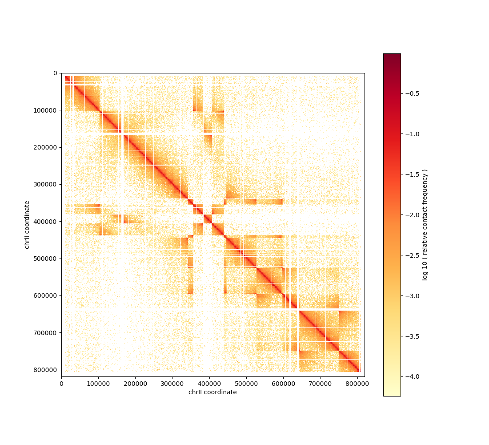

# Tutorial Hi-C Reassembler

In this notebook we give a example of how to run Hi-C reassembler in order to reassemble a scrambled genome using reference reads. We will show an entire pipeline.

## Input data

As input data, we will use sample reads from [Piazza *et al.*, Nat Cell Biol.](https://pubmed.ncbi.nlm.nih.gov/34750581/). The accession number of the fastq sequences is **SRR12284724** and the genome used is **Saccharomyces cerevisiae strain W303** (chromosome II can be found in `tutorial_data/`).  
The Hi-C reads can be downloaded with the command lines :  

```read_download
curl -L ftp://ftp.sra.ebi.ac.uk/vol1/fastq/SRR122/024/SRR12284724/SRR12284724_1.fastq.gz -o tutorial_data/hic_reads_rev.fastq.gz
curl -L ftp://ftp.sra.ebi.ac.uk/vol1/fastq/SRR122/024/SRR12284724/SRR12284724_2.fastq.gz -o tutorial_data/hic_reads_for.fastq.gz
```

In order to generate the rest of the input data, we will first use [hicstuff](https://github.com/koszullab/hicstuff) to align the reads and generate the contact map.

## Training
### Using the furnished models

The code provides already trained models for the matrix detector, established from the genome of Saccharomyces cerevisiae and Homo Sapiens.  
They can be found in `data/pre-trained_models/yeast/` and `data/pre-trained_models/human/`. Copy and paste the content of the model (the 3 files) to be used in the directory `data/models/matrixdetector/`.

### Creating your own dataset 

The code also provides script to create your own dataset. You can create a dataset using the reads and the genome provided above, or using your own Hi-C reads and reference genome.  
We can for example use the data provided above:

* Forward Hi-C reads: tutorial_data/hic_reads_for.fastq.gz
* Reverse Hi-C reads: tutorial_data/hic_reads_rev.fastq.gz
* Assembly sequence: tutorial_data/W303_chrII.fa

you can create a dataset using the following command line. It can take a moment, because the reads must be realigned for each matrix.

```create_dataset
python create_dataset/matrixdetector/create_dataset_matrix.py -1 tutorial_data/hic_reads_for.fastq.gz -2 tutorial_data/hic_reads_rev.fastq.gz -b 1000 -r 50 -c chrII -N 5 tutorial_data/W303_chrII.fa out_scrambling/
```

Then, you have to move the files `out_scrambling/dataset/imgs.npy` and `out_scrambling/dataset/labels.npy` in `data/training/matrixdetector/`. Then, execute the training with

```
make train
```


## Running Hi-C Reassembler

In order to start the pipeline, we will simply create an artificially scrambled matrix using hicstuff on a scrambled genome.  
You can run the following command in order to create a scrambled matrix :

```
python create_dataset/matrixdetector/create_dataset_matrix.py -1 tutorial_data/hic_reads_for.fastq.gz -2 tutorial_data/hic_reads_rev.fastq.gz -b 1000 -r 1 -m scrambled -c chrII -N 5 tutorial_data/W303_chrII.fa out_scrambling/
```

The results of the scrambling can be found in `out_scrambling/scrambling/` as the outputs of hicstuff.

You can view the contact map of the scrambled matrix using [cooler](https://cooler.readthedocs.io/en/latest/index.html).

```
cooler balance out_scrambling/scrambling/scrambled_0/scrambled_0.cool
cooler show -b out_scrambling/scrambling/scrambled_0/scrambled_0.cool chrII
```

Example:  



### Pipeline

You can now run the whole pipeline with the previously generated contact map using

```
python scripts/pipeline.py -b 1000 -o out_reassembly/ chrII out_scrambling/scrambling/scrambled_0/scrambled_0.cool out_scrambling/scrambling/scrambled_0/tmp/scrambled_0.for.bam out_scrambling/scrambling/scrambled_0/tmp/scrambled_0.rev.bam out_scrambling/scrambling/scrambled_0/tmp/scrambled_0.valid_idx.pairs out_scrambling/scrambling/scrambled_0/mod_genome_0.fa
```

The pipeline saves a reassembled genome and aligns the reads on this new genome to allow the user to see the quality of the reassembly.

You can also run the pipeline with your own data. The reassembld genome will be saved at the same place. Keep in mind that if the data used for detection is very different from the data used for the training, the results will be impacted.

### Detection

You can also run only the detection using the following command (the last argument is useful if you want to compare the results with the actual positions of the breakpoints created by the previous script).

```
python scripts/detect.py -b 1000 chrII out_scrambling/scrambling/scrambled_0/scrambled_0.cool out_scrambling/scrambling/scrambled_0/tmp/scrambled_0.for.bam out_scrambling/scrambling/scrambled_0/tmp/scrambled_0.rev.bam out_scrambling/scrambling/scrambled_0/mod_genome_0.fa out_scrambling/scrambling/scrambled_0/breakpoints_0.txt
```